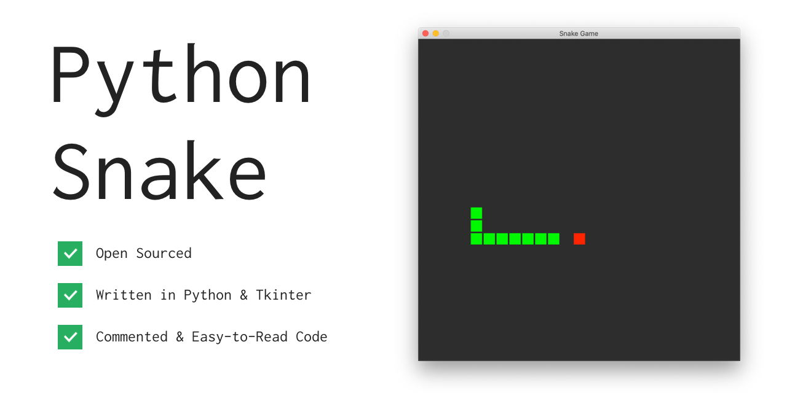

# Python Snake

The classic snake game made in [Python Tkinter](https://docs.python.org/2/library/tkinter.html). Written for Python2 by [Gabriel Romualdo](https://xtrp.io/). Licensed under the [MIT License](https://choosealicense.com/licenses/mit/).


## Overview

The game is just like the original: a snake trying to eat an apple. The snake is colored green, and the apple is red. You are the snake; move using the arrow keys, and avoid eating your own tail. 

In this version, it is possible to move through walls, although it is possible to change this by editing the ```if``` statements starting on line 100.

The code is well commented, and only requires Python2 to be installed, however, it does use Tkinter, which should come pre-installed with Python2, but may not be for various reasons. Additional download information is below.

## Basic Instructions

Use the arrow keys to move: the left arrow key to move left, the right arrow key to move right, the up arrow key to move up, and the down arrow key to move down.

## Download and Play

1. Make sure you have Python installed. Install Python at [python.org](https://www.python.org/downloads/). Most computers running macOS should have Python pre-installed. Check if you have Python installed by typing the command ```python``` and pressing enter in your command prompt or terminal. If a prompt like ```>>>``` shows up, then Python is installed.
    
2. Run the following command to download and play Python Snake! Note that this will download a file called ```snake.py``` into your current working directory.
 
    ```bash
    curl https://xtrp.github.io/python-snake/snake.py -o snake.py && python snake.py
    ```

## Bugs or Issues

If you find a bug or have an issue with Python Snake, feel free to [Submit an Issue](https://github.com/xtrp/python-snake/issues/new).

